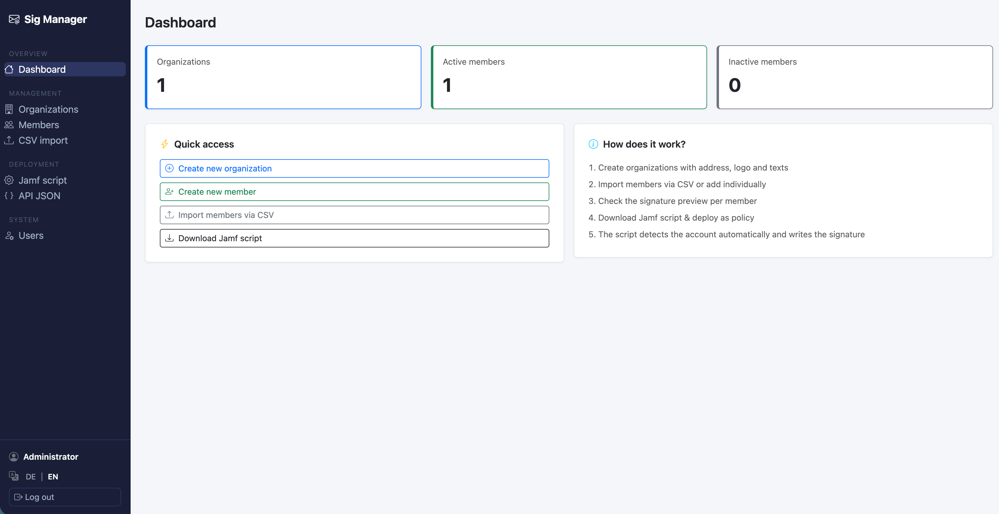

# MailSign for Jamf

**Centrally manage Apple Mail signatures for your whole fleet and deploy them with Jamf Pro — self-hosted, no third-party cloud.**

[](LICENSE)


MailSign is a small, self-hosted web app that manages email signatures for multiple
organizations and their members, and ships a ready-to-run Jamf deployment script that
writes the correct `.mailsignature` files onto each Mac. You keep full control of your
data — it runs on your own server.

<!-- TODO: replace with a real screenshot, e.g. docs/screenshot.png -->
<!--  -->

> **Why?** Most Apple Mail signature solutions are paid SaaS products that route your
> staff data through a third party. If you run Jamf Pro, you don't need that — you need
> a place to manage signatures and a script that deploys them reliably. MailSign is
> exactly that, on infrastructure you control.

## Contents

- [Features](#features)
- [How it works](#how-it-works)
- [Requirements](#requirements)
- [Quick start](#quick-start-docker)
- [Documentation](#documentation)
- [Updating](#updating)
- [Backups](#backups)
- [Security](#security)
- [Good to know](#good-to-know)
- [Contributing](#contributing)
- [Support](#support)
- [License](#license)

## Features

- **Multi-organization management** — manage signatures for several organizations, each with its own name, address, logo, custom note, and confidentiality disclaimer.
- **Member management** — add members individually or bulk-import via CSV.
- **Signature templates** — pick a layout per organization: *classic*, *minimal*, *logo* (logo left / text right), *compact*, *accent bar* (brand color), or write your own **custom HTML** with placeholders (`{{name}}`, `{{email}}`, `{{logo}}`, …).
- **Live preview** — see each signature rendered as it will appear in Apple Mail.
- **Jamf deployment** — download a self-contained bash script (uses only built-in macOS tools — no Python or Command Line Tools required on the client) and run it as a Jamf policy.
- **PPPC profile generator** — generates the configuration profile that allows the deployment script to control Apple Mail via AppleScript.
- **API-key protected endpoints** — clients fetch their signatures over a key-protected API.
- **Idempotent & deterministic** — each signature gets a stable UUID; re-running the policy updates instead of duplicating.
- **Bilingual UI** — German and English.

## How it works

```
┌─────────────────┐      manage data        ┌──────────────────────┐
│  You (browser)  │ ──────────────────────► │  MailSign web app     │
└─────────────────┘                         │  (your server, HTTPS) │
                                            └──────────┬────────────┘
                                                       │  signature data (API key)
                                                       ▼
┌─────────────────┐   runs Jamf policy      ┌──────────────────────┐
│   Jamf Pro      │ ──────────────────────► │  Each Mac runs the    │
└─────────────────┘                         │  deploy script →      │
                                            │  writes .mailsignature │
                                            └──────────────────────┘
```

1. You manage organizations and members in the web app.
2. You download the **Jamf script** and **PPPC profile** once and set them up in Jamf Pro.
3. On each Mac the script runs as the logged-in user, fetches that user's current
   signature from the server, and writes it into Apple Mail.

**The key benefit:** when something changes (new member, new logo, edited text), you
only update the data in the web app. The script on the Macs fetches the latest data on
its next run — **no need to re-upload anything to Jamf**. Signature UUIDs are derived
from the email address, so updates replace cleanly instead of creating duplicates.

## Requirements

- A server with **Docker** (a small VPS is plenty) — or Python 3.12+ to run it directly.
- **Jamf Pro** to deploy to your fleet.
- The Macs must be able to reach the server (an internal network is fine).
- **macOS 12 Monterey – 15 Sequoia** on the clients.

## Quick start (Docker)

```bash
# 1. Clone
git clone https://github.com/o8s-dev/mailsignature-for-jamf.git
cd mailsignature-for-jamf

# 2. Configure the secret key
cp .env.example .env
# edit .env and set SECRET_KEY to a random value, e.g.:
openssl rand -hex 32

# 3. Build & run
docker compose up -d --build
```

The app is now on port **5050**. Open it in your browser — on first visit you'll be
prompted to create the initial admin account.

For production, put a reverse proxy (e.g. Caddy) in front for automatic HTTPS and point
the app at a real domain. See **[docs/installation.md](docs/installation.md)** for the
full guide.

## Documentation

| Guide | What's inside |
|---|---|
| **[Installation](docs/installation.md)** | Server setup, Docker, `.env`, HTTPS reverse proxy, first login |
| **[Jamf deployment](docs/jamf-deployment.md)** | Upload the PPPC profile & script, create the policy, roll out, update |
| **[Configuration](docs/configuration.md)** | Environment variables, signature templates & custom-HTML placeholders, CSV format, API key |

## Updating

```bash
git pull
docker compose up -d --build
```

Your data is preserved — `data/` (the SQLite database) and `static/logos/` are mounted
as volumes, and `.env` is not in the repo. The database is migrated automatically on
start.

## Backups

Everything important lives in two folders:

```bash
tar czf mailsign-backup-$(date +%F).tar.gz data static/logos
```

## Security

- Always run behind **HTTPS** in production (reverse proxy).
- Keep `SECRET_KEY` secret and out of version control (`.env` is git-ignored).
- The signature API is protected by an API key; regenerate it from the Deploy screen if needed.
- Custom-HTML signatures are filled via safe placeholder substitution (no template engine
  on user input) and values are HTML-escaped.
- If you store other organizations' personal data, comply with applicable data-protection
  law (e.g. Swiss FADP / GDPR).

## Good to know

MailSign is **single-tenant** in terms of access: every logged-in user can see and manage
**all** organizations (the `admin` flag only governs user management). This is ideal for
running it for your own company, or as a managed service where **you** maintain everyone's
signatures. Per-customer self-service with isolated logins (multi-tenancy) is **not** built
in yet.

## Contributing

Issues and pull requests are welcome! See **[CONTRIBUTING.md](CONTRIBUTING.md)** for the
local dev setup and the translation workflow.

## Support

MailSign is free and open source. If it's useful to you, a ⭐ on the repository helps
others find it.

## License

Released under the [MIT License](LICENSE). Use it freely, including commercially.
